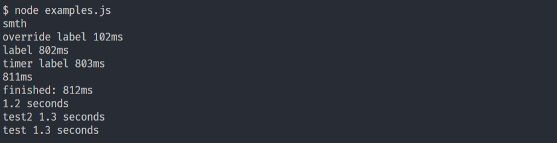

# Elapsed time logger
Similiar to console.time() & console.timeEnd() but returns formatted elapsed time `custom label: 4 hours 10 minutes 23.5 seconds` or if less then a second: `540ms`
Works in NodeJS and in browser.


[![Coverage Status][coveralls-image]][coveralls-url]


[coveralls-image]: https://img.shields.io/coveralls/github/vltansky/elapsed-time-logger
[coveralls-url]: https://coveralls.io/github/vltansky/elapsed-time-logger

package depends on [Browser-hrtime](https://github.com/vltansky/browser-hrtime)

**1.28 KB** (minified and gzipped)

## Installation

```bash
npm install elapsed-time-logger # yarn add elapsed-time-logger
```

## Examples
### NodeJS
```js
const elapsed = require("elapsed-time-logger");
// chalk is't required, added as example to show that you can use colors in output
const chalk = require('chalk');
 
// elapsed is similliar to console.time() & console.timeEnd() 
elapsed.start('label');
elapsed.start('label_id');
setTimeout(()=>{
    elapsed.end('label');//output: label 801ms
    elapsed.end('label_id', 'Text that goes here will override label on output');
    // output: Text that goes here will override label on output 801ms
}, 800);
// if parameter label is not provided, start() will return an instance 
const elapsedTimer = elapsed.start();
const elapsedTimer2 = elapsed.start();
setTimeout(()=>{
    elapsedTimer2.end(chalk.green('you can use colors here, try chalk or colors packages:'));
    // output: you can use colors here, try chalk or colors packages: 806ms
    const time = elapsedTimer.get();//return 806ms
    console.log(time);
    elapsedTimer.end('finished:');// output: finished: 806ms
}, 800);
```


### Web with module
```js
import elapsed from 'elapsed-time-logger';

elapsed.start('testoverride');
setTimeout(()=>{
    elapsed.end('testoverride', 'override label');
}, 100);

elapsed.start('vlad');
setTimeout(()=>{
    const test = elapsed.get('vlad');
    console.log(test);
}, 1200);

// ElapsedLogger is similliar to console.time() & console.timeEnd() 
elapsed.start('label');
elapsed.start('timer label');
setTimeout(()=>{
    elapsed.end('label');
    elapsed.end('timer label');
}, 800);

// or use ElapsedLogger as an instance (recommended)
const elapsedTimer = elapsed.start();
setTimeout(()=>{
    const t = elapsedTimer.get();
    console.log(t);
    elapsedTimer.end('finished:');
}, 800);
```


## Web
```html
<script crossorigin src="https://unpkg.com/browser-hrtime/lib/hrtime.js"></script>
<script crossorigin src="https://unpkg.com/elapsed-time-logger/lib/elapsed-time-logger.min.js"></script>
```
```javascript
    elapsedLogger.start('test2');
    setTimeout(()=>{
        elapsedLogger.end('test2');
    }, 1300);


    elapsedLogger.start('test');
    setTimeout(()=>{
        elapsedLogger.end('test');
    }, 1300);

    elapsedLogger.start('testoverride');
    setTimeout(()=>{
        elapsedLogger.end('testoverride', 'override label');
    }, 100);


    elapsedLogger.start('vlad');
    setTimeout(()=>{
        const test = elapsedLogger.get('vlad');
        console.log(test);
    }, 1200);

    // ElapsedLogger is similliar to console.time() & console.timeEnd() 
    elapsedLogger.start('label');
    elapsedLogger.start('timer label');
    setTimeout(()=>{
        elapsedLogger.end('label');
        elapsedLogger.end('timer label');
    }, 800);


    // or use ElapsedLogger as an instance (recommended)
    const elapsedTimer = elapsedLogger.start();
    // const elapsedTimer2 = elapsedLogger.start();
    console.log('smth');
    setTimeout(()=>{
        const t = elapsedTimer.get();
        console.log(t)
        elapsedTimer.end('finished:');
    }, 800);
```

##  Contribution

Clone project from Github

```bash
git clone git@github.com:vltansky/elapsed-time-logger.git
```

Install npm packages

```bash
cd elapsed-time-logger
npm install
```

Build sources

```bash
npm run build
```
Test

```bash
npm run test
```
=======
### License

[MIT](LICENSE)